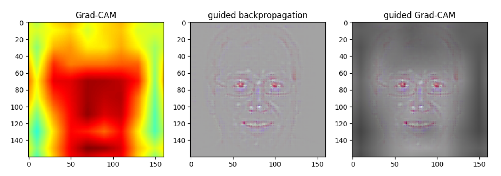

# Gradient based Class Activation Maps (Grad-CAM)
Grad-CAM tested on trained gender classification model.
Reference code from https://github.com/insikk/Grad-CAM-tensorflow

## Model
* https://drive.google.com/open?id=1Dt0FWfl4BMlrLE-yVIFyj2_oTZAUgF3g

## Guided ReLU
 

## Examples

## Little girl

## Old man

